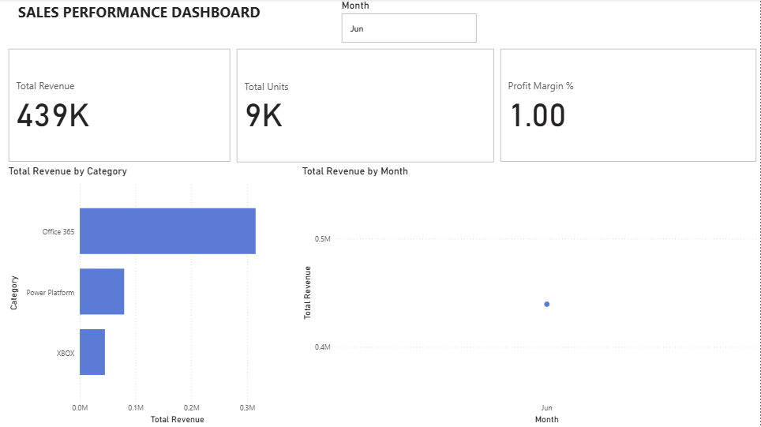

# Sales Performance Dashboard — Power BI

Built a sales performance dashboard using the Microsoft Sales & Returns sample dataset.



## Visuals
- KPI cards (Total Revenue, Total Units, Profit Margin %)
- Revenue by category bar chart
- Monthly revenue trend line chart
- Interactive month slicer

## DAX Measures
```dax
Total Revenue = SUM(Sales[Amount])
Total Units = SUM(Sales[Unit])
Profit Margin % = DIVIDE([Total Revenue], SUMX(Sales, Sales[Unit] * RELATED(Product[Price])))
```

## Data Model
Star schema with Sales as the fact table connected to Product, Customer, Store, and Calendar dimension tables.

## Tools
Power BI Desktop · DAX · Power Query
